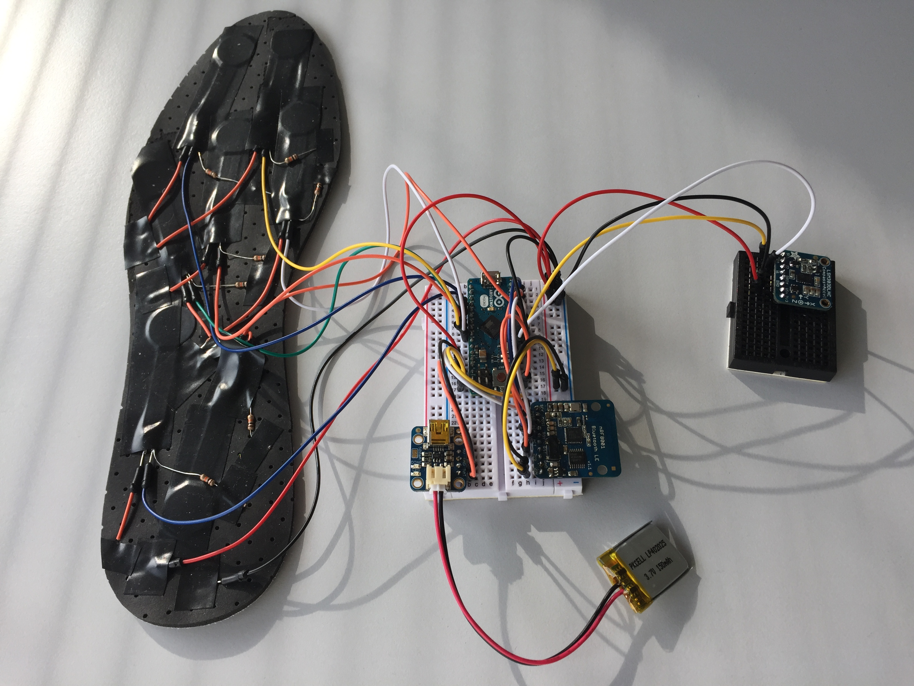

<h1 align="center">SENSMOVE</h1>
 

  

 

  

## About
Sensmove is the first open-sourced smart insole system which provide to the user the ability to visualize his foot forces simultaneously on his smartphone.
The smart insole include 7 force sensitive resistor sensors distributed along it. The data are sent through bluetooth to the mobile phone. Then, on the smartphone, when the user starts a new session, he can visualize his foot forces through circle charts. Once the session is finished, a summary is done and the user can grasp a session name, an activity and a description. The user can also see his profile and the history of the differents sessions he did.

  

## Possibles use cases
- Sport: Help sportsmen in their trainning by coaching them trough an application and check that the person performs his exercises correctly. Check your strides.
- Music: Use it as a loop pedal or metronome.
- Robotic: Stabilize balance of a robot.
- Medical: Help podologs to design better insole, help kinesitherapists to follow their patients during their consultation.

## Technologies
- Arduino environment for insole electronic system.
- iOS (swift) for the mobile application development.

## Improvements
This first draft include a limited set of feature, the final purpose is to provide an as usable as possible open-source smart insole system.
Some improvements have to be done, mainly on the bluetooth transmission between the hardware and the iOS App. The app is not scaling correctly, data has to be stored on a mobile database (SQLite).

Have a look at the github issues for more informations.

## [Documentation](documentation/index.md)

## Application design

  

  

  

